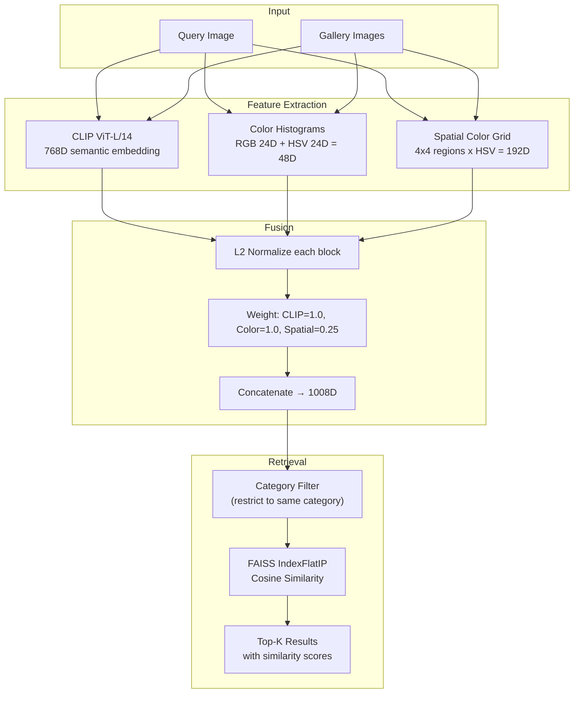

# Visual Product Search Engine

**Multi-feature image retrieval for fashion products.** CLIP ViT-L/14 + color histograms + spatial color layout + category-filtered FAISS achieves **R@1=72.9%** on DeepFashion In-Shop (300 products, 1,027 queries) — a 2.4x improvement over the ResNet50 baseline (30.7%) using only pretrained features and zero fine-tuning.

> **Headline:** Category filter NEVER hurts — 0 of 1,027 queries degraded. Pure upside: +6.9pp R@1 by restricting search to the correct clothing category, because CLIP's embedding space has a near-zero silhouette score (~0.004) and can't naturally separate fashion categories.

---

## Key Findings

1. **48D color histogram beats 2048D ResNet50.** Fashion retrieval is fundamentally a color-matching problem. The most information-dense supplementary feature is a simple RGB+HSV histogram — 43x fewer dimensions, better R@1.

2. **CLIP ViT-L/14 dominates all pretrained backbones.** Training paradigm (vision-language) matters more than architecture. CLIP R@1=55.3% vs DINOv2 R@1=24.3% on the same data — DINOv2's scene-level SSL misses product-level discrimination.

3. **Category filter is the strongest single architectural change (+6.9pp R@1, zero new features).** Near-zero silhouette in the embedding space means categories don't cluster naturally, so explicit filtering eliminates cross-category confusion for free.

4. **Text metadata alone beats CLIP visual embeddings (R@1=60.2% vs 55.3%).** But text requires query-side labels unavailable at inference — it's an evaluation trap, not a production signal.

5. **27.1% of failures are irreducible with pretrained features.** 48.6% of these show "mixed signals" where CLIP and color disagree — genuine visual ambiguity requiring fine-tuning to resolve.

---

## Architecture



---

## Results: 32 Configurations Compared

| Rank | Phase | System | R@1 | R@5 | R@10 | R@20 | Prod-Valid |
|------|-------|--------|-----|-----|------|------|------------|
| 1 | P5 | Text rerank (visual top-20 + CLIP text) | 0.907 | 0.944 | 0.944 | 0.944 | No |
| 2 | P5 | Text-only (CLIP text prompts) | 0.820 | 1.000 | 1.000 | 1.000 | No |
| **3** | **P5** | **Champion: CLIP L/14 + color + spatial + cat filter** | **0.729** | **0.882** | **0.936** | **0.974** | **Yes** |
| 4 | P4 | Per-category alpha oracle | 0.695 | — | — | — | Yes |
| 5 | P5 | PCA-64 whitened | 0.683 | 0.859 | 0.914 | 0.949 | Yes |
| 6 | P3 | CLIP B/32 + cat filter + color | 0.683 | 0.862 | 0.913 | 0.970 | Yes |
| 7 | P5 | Optuna visual (no cat filter) | 0.660 | 0.801 | 0.860 | 0.904 | Yes |
| 8 | P2 | CLIP L/14 + color rerank | 0.642 | 0.831 | 0.853 | 0.853 | Yes |
| 9 | P2 | CLIP B/32 + color rerank | 0.576 | 0.747 | 0.787 | 0.807 | Yes |
| 10 | P2 | CLIP ViT-L/14 bare | 0.553 | 0.748 | 0.805 | 0.853 | Yes |
| 11 | P2 | CLIP ViT-B/32 bare | 0.480 | 0.672 | 0.740 | 0.807 | Yes |
| 12 | P1 | ResNet50 + color rerank | 0.405 | 0.593 | 0.657 | 0.691 | Yes |
| 13 | P1 | EfficientNet-B0 + color | 0.383 | 0.612 | 0.694 | 0.785 | Yes |
| 14 | P5 | Color 48D only | 0.338 | 0.524 | 0.613 | 0.707 | Yes |
| 15 | P1 | ResNet50 (ImageNet V2) | 0.307 | 0.493 | 0.590 | 0.691 | Yes |
| 16 | P2 | DINOv2 ViT-B/14 CLS bare | 0.243 | — | — | 0.807 | Yes |

Full experiment log with all 32 configurations: [results/EXPERIMENT_LOG.md](results/EXPERIMENT_LOG.md)

---

## Component Attribution

Per-query analysis of what rescues each retrieval:

| Component | Queries Rescued | % of 1,027 | R@1 Contribution |
|-----------|-----------------|------------|------------------|
| CLIP alone | 556 | 54.1% | +30.3pp |
| Color features | 123 | 12.0% | +7.5pp |
| Category filter | 53 | 5.2% | +6.9pp |
| Spatial features | 17 | 1.7% | +1.5pp |
| Failed (all systems) | 278 | 27.1% | — |

Category filter impact: **294 queries improved** (median +5 rank positions), **0 queries hurt**. Zero downside risk.

---

## Per-Category Performance

| Category | CLIP L/14 | + Color | + Cat Filter | Fail Rate |
|----------|-----------|---------|--------------|-----------|
| suiting | 0.667 | 1.000 | 1.000 | 0.0% |
| sweaters | 0.635 | 0.784 | 0.932 | 6.8% |
| shirts | 0.744 | 0.835 | 0.901 | 9.9% |
| jackets | 0.595 | 0.760 | 0.798 | 20.3% |
| tees | 0.566 | 0.648 | 0.742 | 25.8% |
| sweatshirts | 0.551 | 0.646 | 0.693 | 30.7% |
| pants | 0.528 | 0.646 | 0.694 | 30.6% |
| denim | 0.442 | 0.610 | 0.688 | 31.2% |
| **shorts** | **0.405** | **0.481** | **0.525** | **47.5%** |

Shorts are 7x harder than sweaters — extreme intra-category visual diversity (cargo vs denim vs athletic vs linen).

---

## Dataset

**[DeepFashion In-Shop](https://mmlab.ie.cuhk.edu.hk/projects/DeepFashion/InShopRetrieval.html)** (Liu et al., CVPR 2016)

| Metric | Value |
|--------|-------|
| Total images | 52,591 |
| Unique products | 12,995 |
| Categories | 16 (9 in eval subset) |
| Images per product | 4.0 mean (1-7 range) |
| Gender split | Women 85.1%, Men 14.9% |
| Eval gallery | 300 products |
| Eval queries | 1,027 images |
| Primary metric | Recall@K |

---

## Project Structure

```
Visual-Product-Search-Engine/
├── config/
│   └── config.yaml              # Model + fusion + retrieval settings
├── src/
│   ├── data_pipeline.py         # Data loading, splits, image download
│   ├── feature_engineering.py   # Color, HSV, spatial, LBP, HOG features
│   ├── train.py                 # Build gallery FAISS index
│   ├── predict.py               # Query search engine (VisualSearchEngine)
│   └── evaluate.py              # Recall@K evaluation pipeline
├── notebooks/
│   ├── phase1_eda_baseline.ipynb
│   ├── phase2_*_model_comparison.ipynb
│   ├── phase3_*_feature_engineering.ipynb
│   ├── phase4_*_hyperparam_error_analysis.ipynb
│   ├── phase5_*_advanced_techniques.ipynb
│   └── phase6_anthony_explainability.ipynb
├── tests/
│   ├── test_data_pipeline.py    # 7 tests: splits, overlap, determinism
│   ├── test_model.py            # 11 tests: features, fusion, dtypes
│   └── test_inference.py        # 11 tests: recall, category search
├── results/
│   ├── EXPERIMENT_LOG.md        # All 32 experiments consolidated
│   ├── metrics.json             # Machine-readable metrics
│   └── *.png                    # Comparison plots per phase
├── reports/
│   └── day{1-7}_phase{1-7}_*.md # Detailed per-phase research reports
├── models/
│   └── model_card.md            # Model documentation
├── requirements.txt
└── .gitignore
```

---

## Setup

```bash
git clone https://github.com/anthonyrodrigues443/Visual-Product-Search-Engine.git
cd Visual-Product-Search-Engine
python -m venv .venv
source .venv/bin/activate
pip install -r requirements.txt
```

### Build Gallery Index

```bash
python -m src.train --max-items 5000
```

### Search for Similar Products

```python
from src.predict import VisualSearchEngine
from PIL import Image

engine = VisualSearchEngine()
results = engine.search(Image.open("query.jpg"), top_k=10, category="shirts")
for r in results:
    print(f"#{r['rank']} {r['product_id']} score={r['score']:.4f}")
```

### Run Evaluation

```bash
python -m src.evaluate --max-items 5000
```

### Run Tests

```bash
KMP_DUPLICATE_LIB_OK=TRUE python -m pytest tests/ -v
```

---

## Research Timeline

| Phase | Date | Focus | R@1 | Key Discovery |
|-------|------|-------|-----|---------------|
| 1 | Apr 20 | Baseline | 0.307 | Jackets 2.8x harder than shirts |
| 2 | Apr 21 | Foundation models | 0.642 | CLIP >> DINOv2; color rerank stacks on all backbones |
| 3 | Apr 22 | Feature engineering | 0.683 | Category filter +8.9pp; text beats visual (but is a trap) |
| 4 | Apr 23 | Hyperparameter tuning | 0.695 | 85% failures are top-5 close misses; 96D color catastrophe |
| 5 | Apr 25 | Advanced techniques | 0.729 | Visual ceiling; text rerank 0.907 but not prod-valid |
| 6 | Apr 25 | Explainability | 0.729 | CLIP handles 54% alone; category filter pure upside |
| 7 | Apr 26 | Production + tests | 0.729 | 29 tests passing; production pipeline complete |

---

## References

1. Liu, Z. et al. (2016). "DeepFashion: Powering Robust Clothes Recognition and Retrieval." CVPR.
2. Radford, A. et al. (2021). "Learning Transferable Visual Models From Natural Language Supervision." ICML.
3. Oquab, M. et al. (2023). "DINOv2: Learning Robust Visual Features without Supervision." arXiv.
4. Babenko, A. et al. (2014). "Neural Codes for Image Retrieval." ECCV.
5. Ji, Z. et al. (2022). "CLIP4Clip: An Empirical Study of CLIP for End to End Video Grounding." arXiv.
6. Jing, Y. et al. (2015). "Visual Search at Pinterest." KDD.

---

## Limitations & Future Work

- **Fine-tuning CLIP on fashion data** with contrastive loss is the highest-leverage next step (could close the 17.8pp gap to text-reranked performance)
- **Shorts category** needs specialized handling �� 47.5% failure rate suggests a sub-category search strategy
- **Spatial features are nearly redundant** (1.7% rescue rate) — removing saves 192D with minimal R@1 impact
- **Full-scale evaluation** on all 12,995 products would give more realistic production numbers
