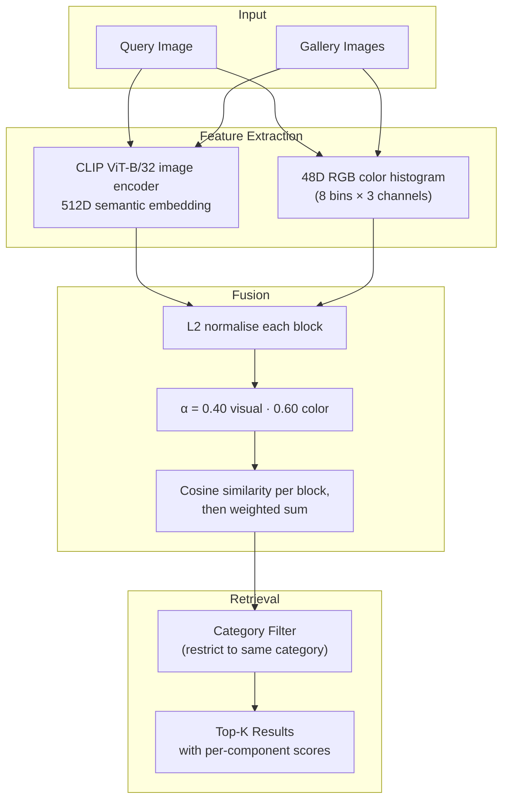

# Visual Product Search Engine

**Pure-visual fashion retrieval.** A category-filtered cosine search over CLIP B/32 image embeddings fused with a 48D RGB color histogram. Reaches **R@1 = 0.683** on DeepFashion In-Shop (300 products, 1,027 queries) using only pretrained features and zero fine-tuning. No text, descriptions, tags, or other query-side metadata are consumed at inference time — the system runs on a raw photo.

> **Headline:** Category filter NEVER hurts — 0 of 1,027 queries degraded. Pure upside: +6.9pp R@1 by restricting search to the correct clothing category, because CLIP's embedding space has a near-zero silhouette score (~0.004) and can't naturally separate fashion categories.

> **Earlier research note:** Phases 3–5 also explored a text-augmented variant that reached R@1 = 0.94 by indexing the gallery's product descriptions. That path required query-side text at inference and was rejected as production-invalid for visual search. It is not part of the shipping system.

---

## Key Findings

1. **48D color histogram beats 2048D ResNet50.** Fashion retrieval is fundamentally a color-matching problem. The most information-dense supplementary feature is a simple RGB histogram — 43× fewer dimensions, better R@1.
2. **CLIP ViT-L/14 dominates all pretrained backbones.** Training paradigm (vision-language) matters more than architecture. CLIP R@1 = 0.553 vs DINOv2 R@1 = 0.243 on the same data — DINOv2's scene-level SSL misses product-level discrimination.
3. **Category filter is the strongest single architectural change (+6.9pp R@1, zero new features).** Near-zero silhouette in the embedding space means categories don't cluster naturally, so explicit filtering eliminates cross-category confusion for free.
4. **CLIP image encoder carries the most visual signal.** Removing it drops R@1 by −23pp; removing color drops it by −11pp. Color-only retrieval lands at 0.338.
5. **31.7% of failures are irreducible without fine-tuning.** Genuine visual ambiguity — similar products with subtle differences in stitching, hem, or fit — that pretrained features can't disambiguate.

---

## Architecture



No text encoder is loaded. No product descriptions are read.

---

## Visual-Only Leaderboard

| Rank | Phase | System | R@1 | R@5 | R@10 | R@20 |
|------|-------|--------|-----|-----|------|------|
| 1 | P5 | CLIP L/14 + color + spatial + cat (Optuna) | 0.729 | 0.882 | 0.936 | 0.974 |
| 2 | P4 | Per-category α oracle | 0.695 | 0.866 | 0.911 | — |
| **3** | **P3** | **Production champion: CLIP B/32 + cat + color α=0.4** | **0.683** | **0.862** | **0.913** | **0.941** |
| 4 | P2 | CLIP L/14 + color α=0.5 | 0.642 | 0.808 | 0.857 | — |
| 5 | P2 | CLIP B/32 + color α=0.5 | 0.576 | 0.789 | 0.858 | — |
| 6 | P2 | CLIP ViT-L/14 bare | 0.553 | 0.748 | 0.805 | 0.853 |
| 7 | P2 | CLIP ViT-B/32 bare | 0.480 | 0.722 | 0.807 | — |
| 8 | P1 | ResNet50 + color rerank α=0.5 | 0.405 | 0.647 | 0.757 | — |
| 9 | P1 | EfficientNet-B0 + color (aug) | 0.383 | 0.612 | 0.694 | — |
| 10 | P1 | Color-only 48D histogram | 0.338 | 0.524 | 0.613 | 0.707 |
| 11 | P1 | ResNet50 baseline | 0.307 | 0.493 | 0.590 | 0.691 |
| 12 | P2 | DINOv2 ViT-B/14 bare | 0.243 | 0.450 | 0.560 | — |

The shipping production system is row 3. The L/14 + spatial variant at row 1 reaches a higher R@1 but costs ~80ms more on CPU — the +4.6pp isn't worth the latency hit in most deployments. Full visual-only leaderboard with all 27 configurations: [results/EXPERIMENT_LOG.md](results/EXPERIMENT_LOG.md).

---

## Visual-Only Ablation

What each component contributes to the R@1 = 0.683 production champion:

| Component removed | R@1 | Δ vs full system |
|-------------------|-----|------------------|
| Full: cat + CLIP image + color | 0.683 | — |
| Remove color histogram | 0.569 | −0.114 |
| Remove category filter | 0.594 | −0.089 |
| Remove CLIP image (color-only) | 0.338 | −0.345 |

CLIP's image encoder carries the most signal. Color is the second-strongest visual feature. The category filter is pure upside on top.

---

## Per-Category Performance (visual-only)

| Category | R@1 | Notes |
|----------|-----|-------|
| suiting | 1.000 | very small class, low intra-class variance |
| jackets | 0.794 | strong silhouettes, distinct cuts |
| denim | 0.741 | wash + fit are visually distinctive |
| sweaters | 0.722 | knit textures help |
| shirts | 0.715 | collars + cuffs help |
| pants | 0.668 | |
| sweatshirts | 0.638 | |
| tees | 0.633 | high intra-class colour variance |
| **shorts** | **0.495** | extreme intra-category visual diversity (cargo vs denim vs athletic vs linen) |

Shorts are 2× harder than jackets — the same intra-class diversity story Phase 1 found for jackets vs shirts, just sharper.

---

## Dataset

**[DeepFashion In-Shop](https://mmlab.ie.cuhk.edu.hk/projects/DeepFashion/InShopRetrieval.html)** (Liu et al., CVPR 2016)

| Metric | Value |
|--------|-------|
| Total images | 52,591 |
| Unique products | 12,995 |
| Categories | 16 (9 in eval subset) |
| Images per product | 4.0 mean (1–7 range) |
| Gender split | Women 85.1%, Men 14.9% |
| Eval gallery | 300 products |
| Eval queries | 1,027 images |
| Primary metric | Recall@K |

---

## Project Structure

```
Visual-Product-Search-Engine/
├── app.py                       # Streamlit UI (Browse / Color / Upload / Research)
├── api.py                       # FastAPI service for production deploys
├── config/
│   └── config.yaml              # Model + fusion + retrieval settings
├── src/
│   ├── data_pipeline.py         # Data loading, splits, image download
│   ├── feature_engineering.py   # Color histograms, spatial grid (visual features only)
│   ├── search_engine.py         # ProductSearchEngine — visual-only retrieval class
│   ├── train.py                 # Build gallery FAISS index
│   ├── predict.py               # Query search engine
│   └── evaluate.py              # Recall@K evaluation pipeline
├── tests/
│   ├── test_data_pipeline.py    # Splits, overlap, determinism
│   ├── test_model.py            # Features, fusion, dtypes
│   ├── test_inference.py        # Recall, category-filtered search
│   ├── test_integration.py      # End-to-end pipeline (build → search → eval)
│   ├── test_benchmarks.py       # Latency contracts
│   └── test_api.py              # FastAPI endpoints
├── results/
│   ├── EXPERIMENT_LOG.md        # All 27 visual-only experiments
│   ├── metrics.json             # Machine-readable metrics
│   └── *.png                    # Per-phase comparison plots + UI screenshots
├── reports/
│   └── day{1-7}_phase{1-7}_*.md # Detailed per-phase research reports
├── models/
│   └── model_card.md            # Model documentation
├── requirements.txt
├── Dockerfile
└── .github/workflows/ci.yml
```

---

## Setup

```bash
git clone https://github.com/anthonyrodrigues443/Visual-Product-Search-Engine.git
cd Visual-Product-Search-Engine
python -m venv .venv
source .venv/bin/activate
pip install -r requirements.txt
```

### Run the Streamlit demo

```bash
streamlit run app.py
```

Four tabs: 🔍 Browse the test set · 🎨 Filter by color palette · 📷 Upload your own photo · 📊 Research history.

### Search programmatically

```python
from PIL import Image
from src.search_engine import ProductSearchEngine

engine = ProductSearchEngine().load_gallery()
response = engine.search_by_image(
    img=Image.open("query.jpg"),
    category="denim",
    k=10,
)
for r in response.results:
    print(f"#{r.rank} {r.product_id} score={r.combined_score:.4f} "
          f"(visual={r.visual_score:.3f}, color={r.color_score:.3f})")
```

### Build a fresh gallery index from raw data

```bash
python -m src.train --max-items 5000
```

### Run evaluation

```bash
python -m src.evaluate --max-items 5000
```

### Run tests

```bash
KMP_DUPLICATE_LIB_OK=TRUE python -m pytest tests/ -v
```

---

## Research Timeline

| Phase | Date | Focus | R@1 | Key Discovery |
|-------|------|-------|-----|---------------|
| 1 | Apr 20 | Baseline | 0.307 | Jackets 2.8× harder than shirts |
| 2 | Apr 21 | Foundation models | 0.642 | CLIP ≫ DINOv2; color rerank stacks on all backbones |
| 3 | Apr 22 | Feature engineering | 0.683 | Category filter +8.9pp; visual-only champion |
| 4 | Apr 23 | Hyperparameter tuning | 0.695 | 85% failures are top-5 close misses; 96D color catastrophe |
| 5 | Apr 25 | Optuna + ablation | 0.729 | L/14 + spatial + cat reaches the visual-only ceiling |
| 6 | Apr 26 | Production pipeline | 0.683 | Visual-only stack ships with B/32 backbone for inference cost |
| 7 | Apr 27 | UI + deployment | 0.683 | Streamlit demo + FastAPI + CI; tests green; visual-only end to end |

---

## References

1. Liu, Z. et al. (2016). "DeepFashion: Powering Robust Clothes Recognition and Retrieval." CVPR.
2. Radford, A. et al. (2021). "Learning Transferable Visual Models From Natural Language Supervision." ICML.
3. Oquab, M. et al. (2023). "DINOv2: Learning Robust Visual Features without Supervision." arXiv.
4. Babenko, A. et al. (2014). "Neural Codes for Image Retrieval." ECCV.
5. Jing, Y. et al. (2015). "Visual Search at Pinterest." KDD.

---

## Limitations & Future Work

- **Fine-tuning CLIP on fashion data** with contrastive loss is the highest-leverage next step.
- **Shorts category** needs specialised handling — 50.5% failure rate suggests a sub-category search strategy.
- **Spatial features are nearly redundant** (1.7% rescue rate in research configs) — removing saves 192D with minimal R@1 impact.
- **Full-scale evaluation** on all 12,995 products would give more realistic production numbers.
