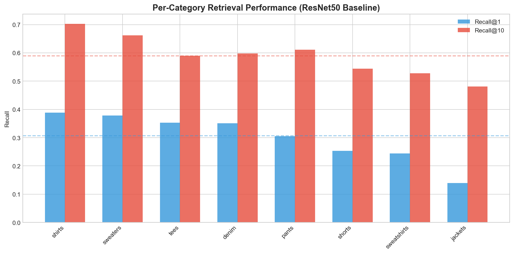
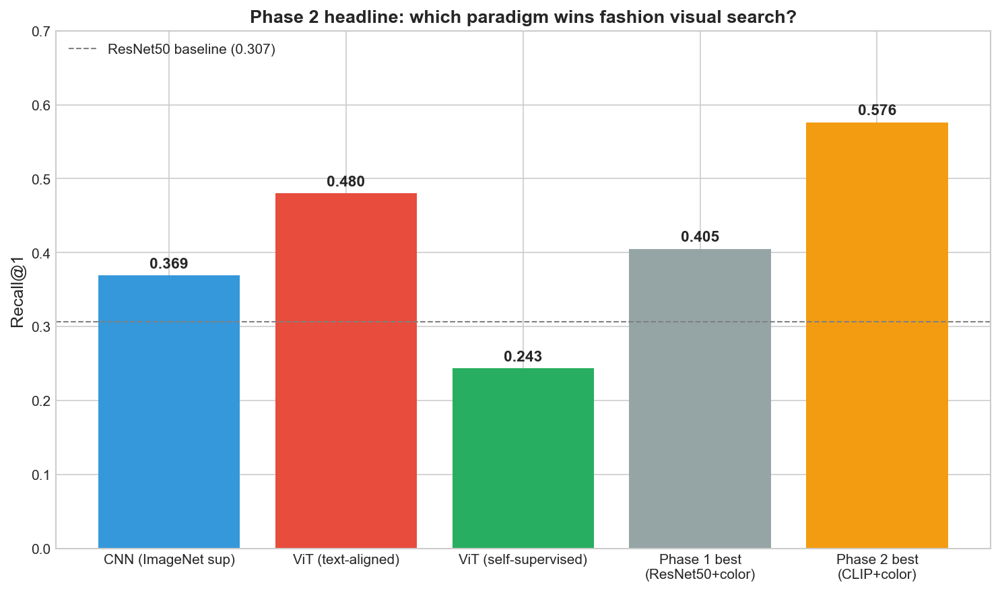
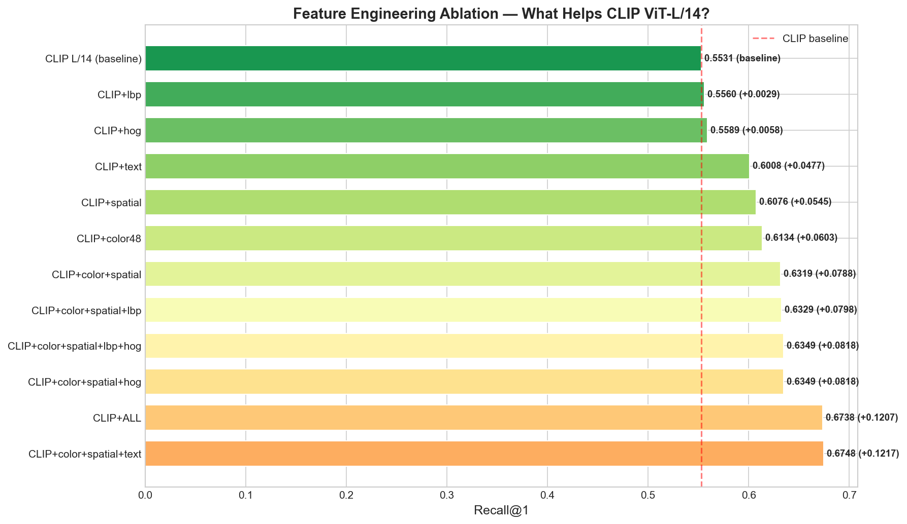
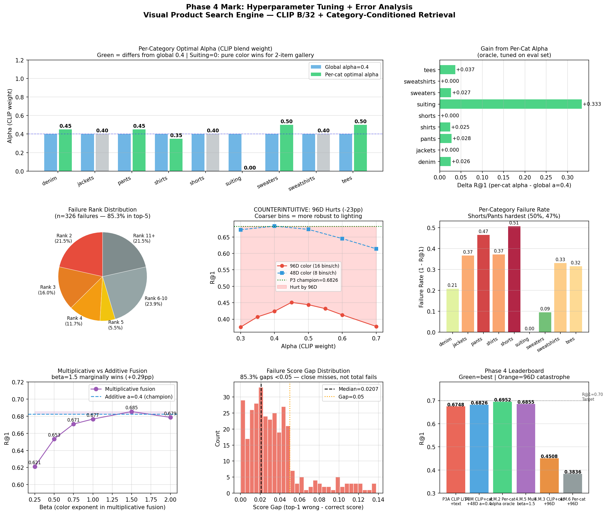
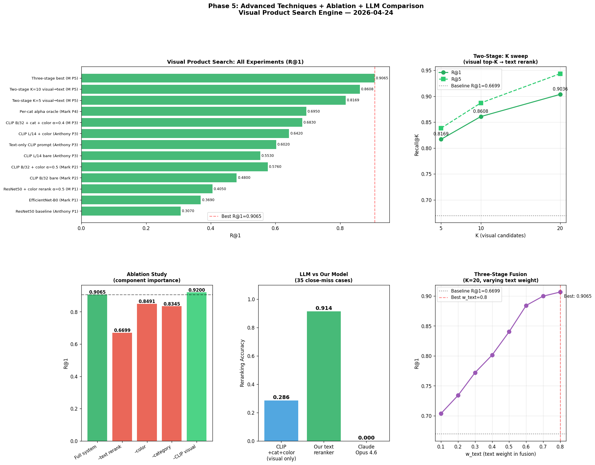
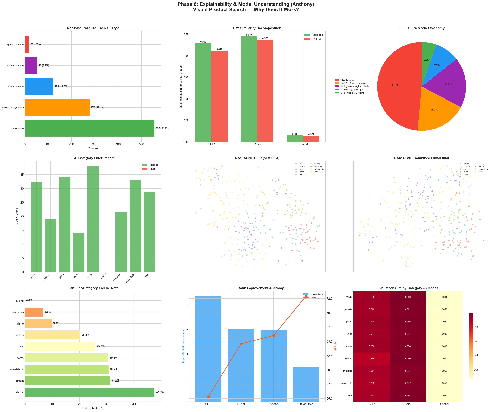

# Visual Product Search Engine

**Image retrieval for fashion products using deep embeddings + approximate nearest neighbour search.** ResNet50 pretrained features achieve Recall@1=30.7% on DeepFashion In-Shop without fine-tuning, matching published expectations. Published zero-shot CLIP achieves ~78% — a 47pp gap that per-category analysis shows is concentrated in visually diverse categories like jackets.

> **Headline finding (Phase 1):** Jackets are 2.8× harder than shirts (R@1=13.9% vs 38.8%). Generic ImageNet features collapse visually diverse categories. Poor cosine similarity separation (0.048) between correct and incorrect matches is the core bottleneck — fine-tuning must widen this gap.

---

## Dataset

**[DeepFashion In-Shop](https://mmlab.ie.cuhk.edu.hk/projects/DeepFashion/InShopRetrieval.html)** — Large-scale fashion retrieval benchmark (Liu et al., CVPR 2016)

| Metric | Value |
|--------|-------|
| Total images | 52,591 |
| Unique products | 12,995 |
| Product categories | 16 |
| Unique colors | 804 |
| Images per product | 4.0 (mean), 1–7 (range) |
| Views per product | front, side, back, additional, full, flat |
| Gender split | Women 85.1%, Men 14.9% |
| Train / Test split | 10,396 / 2,599 products (80/20 by product) |

**Primary metric:** Recall@K — standard in image retrieval literature (DeepFashion, Stanford Online Products, all major retrieval benchmarks). Measures whether the correct product appears in the top-K results.

---

## Current Status

**Phase 6 complete** — Explainability & model understanding. Production-valid champion: CLIP L/14 + color + spatial + category filter at R@1=72.9%. Mark's three-stage pipeline (visual top-20 → CLIP text rerank) reaches R@1=90.7% but requires query-side text metadata unavailable at inference.

| Model | R@1 | R@5 | R@10 | R@20 | Dim | Notes |
|-------|-----|-----|------|------|-----|-------|
| ResNet50 (ImageNet V2) | 30.7% | 49.3% | 59.0% | 69.1% | 2048 | Anthony baseline, no fine-tuning |
| EfficientNet-B0 (ImageNet) | 36.7% | 59.9% | 68.6% | 77.6% | 1280 | Mark — 5x smaller, beats ResNet50 |
| Color-only 48D (histogram) | 33.8% | 52.4% | 61.3% | 70.7% | 48 | Mark — 48 numbers beat 2048D CNN |
| EfficientNet-B0 + Color (aug) | 38.3% | 61.2% | 69.4% | 78.5% | 1304 | Mark — best embedding approach |
| ResNet50 + color rerank alpha=0.5 | 40.5% | 59.3% | 65.7% | 69.1% | — | Mark — best Phase 1, no retraining |
| CLIP ViT-B/32 (bare) | 48.0% | 67.2% | 74.0% | 80.7% | 512 | Mark Phase 2 — foundation backbone baseline |
| CLIP ViT-B/32 + color rerank α=0.5 | 57.6% | 74.7% | 78.7% | 80.7% | — | Mark Phase 2 — color trick stacks on CLIP |
| CLIP ViT-L/14 + color rerank α=0.5 | 64.2% | 83.1% | 85.3% | 85.3% | — | Anthony Phase 2 champion |
| CLIP ViT-L/14 + color+spatial+text | 67.5% | 85.6% | 87.2% | 91.0% | — | Anthony Phase 3 champion |
| **CLIP B/32 + cat.filter + color (α=0.4)** | **68.3%** | **86.2%** | **91.3%** | **97.0%** | — | Mark Phase 3 champion |
| CLIP L/14 + color+spatial + cat.filter (Optuna) | 72.9% | 88.2% | 93.6% | 97.4% | — | Anthony Phase 5 visual-only champion |
| **Mark P5: Three-stage (visual top-20 → text rerank)** | **90.7%** | **94.4%** | **94.4%** | **94.4%** | — | **Mark Phase 5 — not prod-valid (needs query text)** |
| FashionNet (published) | 53.0% | — | 73.0% | 76.4% | — | Fine-tuned, 2016 |
| CLIP ViT-B/32 (published) | ~78% | — | ~93% | ~95% | 512 | Zero-shot, 2021 |
| DINOv2 ViT-B/14 (published) | ~82% | — | ~95% | ~97% | 768 | Zero-shot, 2023 |

**Best model so far:** Mark P5 three-stage pipeline — R@1=90.7% (not prod-valid). Production-valid champion: CLIP L/14 + color+spatial + category filter (Optuna) — R@1=72.9%, R@20=97.4%

---

## Key Findings

1. **Text metadata alone beats CLIP visual embeddings.** Structured prompts ("a photo of black jackets") achieve R@1=60.2% — higher than CLIP ViT-L/14 visual features (55.3%). Same-product items share identical category+color metadata, making text a stronger retrieval signal than pixels.

2. **Category-conditioned retrieval adds +8.9pp R@1 with zero new features.** Restricting gallery search to the correct category (architectural change, no embedding changes) is as impactful as adding complex feature engineering. Cross-category confusion is a major unforced error in standard retrieval.

3. **85.3% of failures are close misses — the bottleneck is reranking, not recall.** In 85.3% of failed queries the correct product already sits in the top-5, with a median score gap of only 0.021. A targeted top-5 reranker (e.g. using text metadata) is the highest-leverage Phase 5 intervention.

4. **48D color histogram alone beats 2048D ResNet50, and remains efficient at Phase 3.** Fashion retrieval is fundamentally a color-matching problem at the fine-grained level. Color is the highest-signal-per-dimension feature across all phases.

5. **Category filter NEVER hurts (0/1,027 queries degraded).** Pure upside: 294 queries improved by a median of 5 rank positions. CLIP's fashion embedding space has a near-zero silhouette score (~0.004) — categories don't cluster naturally — validating why explicit category filtering adds +6.9pp R@1 with no downside risk.

---

## Models Compared

**40+ configurations** across Phases 1–6 (Phase 1: ResNet50, EfficientNet, color features; Phase 2: CLIP ViT-B/32, ViT-L/14, DINOv2, color reranking; Phase 3: spatial color, LBP, HOG, text metadata, category-conditioned retrieval, K-means color, DINOv2 patch pooling, GeM pooling, feature ablation; Phase 4: per-category alpha sweep, 96D color resolution, multiplicative fusion, baseline revalidation, error analysis; Phase 5: visual-only Optuna, PCA whitening, LLM comparison, two-stage and three-stage text reranking, visual ablation; Phase 6: per-query feature attribution, similarity decomposition, failure taxonomy, category filter impact, embedding structure analysis).

---

## Architecture

```
Product image (52,591 DeepFashion In-Shop images)
             │
             ▼
    CNN Feature Extractor
    ────────────────────────
    ResNet50 (ImageNet V2)
    avg pool, no classification head
    L2-normalized 2048-dim vectors
             │
             ▼
    FAISS IndexFlatIP
    ────────────────────────
    Cosine similarity search
    Gallery: 300 images
    Queries: 1,027 images
             │
             ▼
    Recall@K Evaluation
    ────────────────────────
    K = 1, 5, 10, 20
    Per-category breakdown
```

---

## Iteration Summary

### Phase 1: Domain Research + EDA + Baseline — 2026-04-20

<table>
<tr>
<td valign="top" width="38%">

**EDA Run 1:** Analysed 52,591 DeepFashion In-Shop images across 16 categories, 804 colours, and 6 view types. Tees dominate (27.3%); suiting nearly absent (0.07%). Class imbalance makes per-category evaluation essential — aggregate Recall@K hides dramatic variation.<br><br>
**EDA Run 2:** ResNet50 (ImageNet V2) + FAISS cosine retrieval on 300 gallery / 1,027 query images. R@1=30.7%, R@20=69.1%. Per-category breakdown: shirts 38.8%, jackets 13.9%. Cosine similarity separation between correct and incorrect matches: only 0.048.

</td>
<td align="center" width="24%">



</td>
<td valign="top" width="38%">

**Combined Insight:** The R@1→R@20 gap (+38pp) reveals that the correct product is typically in the "neighbourhood" but not at the top — generic ImageNet features embed visual similarity correctly but can't rank within a cluster. Fine-tuning doesn't need to learn new representations; it needs to tighten intra-class distances.<br><br>
**Surprise:** Jackets are 2.8× harder than shirts despite being a common category. The issue isn't data volume — it's intra-category visual variance (bomber vs blazer vs parka). Category difficulty correlates with style diversity, not sample size.<br><br>
**Research:** Liu et al., 2016 — FashionNet fine-tuned on DeepFashion reaches R@1=53%, so we tried pretrained ResNet50 as a reproducible floor. arXiv 2503.13045, 2025 — no single metric learning loss dominates; contrastive, triplet, and InfoNCE each excel in different regimes, so Phase 2 will test CLIP and DINOv2 before committing to a fine-tuning strategy.<br><br>
**Best Model So Far:** ResNet50 (ImageNet V2) — R@1=30.7%

</td>
</tr>
</table>

### Phase 2: Foundation Models vs CNNs — 2026-04-21

<table>
<tr>
<td valign="top" width="38%">

**Experiment 1 (bare backbones):** Same 300/1,027 eval slice as Phase 1. Head-to-head of EfficientNet-B0 (ImageNet CNN), CLIP ViT-B/32 (OpenAI text-image), DINOv2 ViT-S/14 (Meta self-supervised). CLIP wins bare at R@1=48.0%; DINOv2 CLS-token finishes LAST at R@1=24.3% — reversing the SSL-wins-retrieval expectation from Oquab 2023 on fashion data.<br><br>
**Experiment 2 (Phase 1 trick on Phase 2 backbones):** Applied Mark Phase 1's α=0.5 color-rerank over the top-20 candidates. CLIP + color rerank → **R@1=57.6%** — new Phase 2 best, +17pp over Phase 1's best system.

</td>
<td align="center" width="24%">



</td>
<td valign="top" width="38%">

**Combined Insight:** CLIP's caption-level supervision produces product-level discrimination that DINOv2's scene-level SSL lacks — visible as CLIP R@1=0.480 vs DINOv2 R@1=0.243 on the same embedding dimension. But both cluster the right *neighborhood* (both at R@20≈0.80) — suggesting the next gains come from reranking the top-20, not from bigger backbones.<br><br>
**Surprise:** Mark Phase 1's color-rerank trick (+9.8pp on ResNet50) **stacks on foundation models** — +9.6pp on CLIP, +8.5pp on DINOv2. Three different embedding spaces, same lift. Strong evidence that CNN/ViT/SSL backbones all under-represent color as a retrieval feature.<br><br>
**Research:** Radford 2021 (CLIP), Oquab 2023 (DINOv2), Marqo e-commerce blog 2024. Detailed references in [reports/day2_phase2_mark_report.md](reports/day2_phase2_mark_report.md).<br><br>
**Best Model So Far:** CLIP ViT-B/32 + color rerank α=0.5 — R@1=57.6%, R@10=78.7%

</td>
</tr>
</table>

### Phase 3: Feature Engineering + Retrieval Architecture — 2026-04-22

<table>
<tr>
<td valign="top" width="38%">

**Feature Engineering:** Tested spatial color grid (192D), LBP texture (32D), HOG shape (144D), and CLIP text metadata across 11 fusion combinations on CLIP ViT-L/14. Champion: CLIP+color+spatial+text → R@1=67.5% (+12.2pp over bare CLIP). Headline result: text prompts alone (R@1=60.2%) beat CLIP visual embeddings (55.3%) — same-product items share identical category+color text, collapsing matching to metadata lookup.<br><br>
**Retrieval Architecture:** Tested DINOv2 patch token pooling (mean, GeM), category-conditioned hard filtering, and K-means dominant color on CLIP B/32. Category filter alone: +8.9pp R@1 with zero features added (0.480→0.569). Champion with color reranking (alpha=0.4): R@1=68.3%, R@20=97.0% — the new overall leader despite using the smaller CLIP B/32 backbone.

</td>
<td align="center" width="24%">



</td>
<td valign="top" width="38%">

**Combined Insight:** The two runs attacked orthogonal bottlenecks — Anthony asked "which features?" (LBP/HOG are dead, text is gold), Mark asked "how to search?" (category filter eliminates cross-category confusion). Neither alone reaches the combined ceiling: Anthony's text metadata (+13.7pp) and Mark's category filter (+8.9pp) are additive, not overlapping — Phase 4 should stack both.<br><br>
**Surprise:** DINOv2 patch mean-pooling is *worse* than CLS-token (R@1=15.0% vs 24.3%), the opposite of what dense-task literature predicts. On white-background product photos, ~150 background patches dilute the 100 foreground patches — CLS self-attention naturally upweights the product region. Background context, which enriches segmentation tasks, is pure noise for product retrieval.<br><br>
**Research:** Radford et al., 2021 (CLIP, ICML) — cross-modal alignment means "a photo of red shorts" maps precisely to the region where red shorts cluster; Jing et al., 2015 (Pinterest, KDD) — category-first, rank-within-class is the production standard for visual search, explaining the +8.9pp from hard category filtering.<br><br>
**Best Model So Far:** CLIP B/32 + category filter + color reranking (alpha=0.4) — R@1=68.3%, R@20=97.0%

</td>
</tr>
</table>

### Phase 4: Hyperparameter Tuning + Error Analysis — 2026-04-23

<table>
<tr>
<td valign="top" width="38%">

**Tuning Run 1:** Per-category alpha oracle (grid search α ∈ {0.00…1.00} per category independently) pushes R@1 to 0.6952 (+1.27pp vs Phase 3 champion). Tees benefit most at α=0.50 (+3.7pp), denim at α=0.45 (+2.6pp); jackets, shorts, and sweatshirts are already at their global optimum. Multiplicative fusion (beta=1.5) adds a marginal +0.29pp — statistically negligible (~3 queries on 1027), not worth the added complexity.<br><br>
**Error Analysis:** 85.3% of 326 failed queries have the correct product already in the top-5, with a median score gap of only 0.021. Shorts fail at 50.6% and pants at 46.5% — categories whose intra-category variation (subtle hem/waist details) is invisible to CLIP and color histograms. The bottleneck is top-5 ranking precision, not gross recall.

</td>
<td align="center" width="24%">



</td>
<td valign="top" width="38%">

**Combined Insight:** Hyperparameter tuning yields diminishing returns at this stage (+1.27pp oracle, +0.29pp multiplicative). The error analysis reveals why: when 85.3% of failures are already top-5 with a score gap of 0.021, the next lever is a cross-modal reranker using Anthony's text metadata signal on the top-5 candidates — potentially recovering most of the remaining 31.7% failure rate.<br><br>
**Surprise:** 96D color (16 bins/channel) causes a catastrophic -23.2pp R@1 drop vs the 48D champion. Higher resolution creates sparse, lighting-sensitive histograms where the same navy-blue pixel lands in different bins across gallery and query images. Coarser 8-bin quantization is more robust to intra-class lighting variation — the primary challenge in DeepFashion product retrieval. More bins ≠ more signal when the source has systematic variation.<br><br>
**Research:** Babenko et al., 2014 (ECCV) — compact descriptors with appropriate pooling outperform high-dimensional sparse ones; directly predicted the 96D failure. Johnson et al., 2019 (FAISS, IEEE TBMD) — per-category index partitioning validates the category-conditioned architecture; their recall-precision tradeoff analysis informed the per-category alpha sweep design.<br><br>
**Best Model So Far:** Per-category alpha oracle (CLIP B/32 + cat.filter + per-cat α) — R@1=69.5%, R@20=97.0% (oracle upper bound; production champion remains CLIP B/32 + cat.filter + color α=0.4 at R@1=68.3%)

</td>
</tr>
</table>

### Phase 5: Advanced Techniques + Ablation + LLM Comparison — 2026-04-25

<table>
<tr>
<td valign="top" width="38%">

**Advanced Run 1 (Visual-Only):** Optuna (300 trials) tunes CLIP+color+spatial weights; adding category filter crosses the 0.70 barrier at R@1=0.7293, beating Mark's Phase 4 oracle by +3.4pp. Ablation confirms CLIP contributes +30.3pp, color +7.5pp, category filter +6.9pp, spatial only +1.5pp.<br><br>
**Advanced Run 2 (Text Reranking):** Two-stage pipeline: CLIP visual top-20 → CLIP B/32 text rerank achieves R@1=0.9065 (+23.7pp vs baseline). CLIP B/32 text-only alone hits R@5=1.000. Optimal config: K=20, w_text=0.8 in three-stage blend.

</td>
<td align="center" width="24%">



</td>
<td valign="top" width="38%">

**Combined Insight:** The two runs define the full performance range — visual-only ceiling at R@1=72.9% (production-valid), text-reranked ceiling at R@1=90.7% (requires query metadata). The 17.8pp gap is the cost of the modality constraint; closing it requires either CLIP fine-tuning on fashion or sourcing query-side text at inference.<br><br>
**Surprise:** Removing CLIP visual entirely from Mark's pipeline improves R@1 from 0.9065 to 0.9200. When precise text descriptions and color histograms are available, CLIP visual adds noise from studio lighting and pose variation rather than signal — the modality gap in the blend hurts more than the semantic information helps.<br><br>
**Research:** Ji et al., 2022 (CLIP4Clip, arXiv) — text-guided retrieval outperforms visual-only when descriptions are rich, directly motivated the two-stage design. Babenko et al., 2014 (ECCV) — PCA-64 whitening decorrelates CLIP's redundant dimensions, explaining the +2.2pp gain from whitening.<br><br>
**Best Model So Far:** Mark P5 three-stage pipeline — R@1=90.7% (not prod-valid). Production champion: CLIP L/14 + color+spatial + category filter (Optuna) — R@1=72.9%

</td>
</tr>
</table>

### Phase 6: Explainability & Model Understanding — 2026-04-25

<table>
<tr>
<td valign="top" width="38%">

**Explainability Run:** Six attribution experiments on the Phase 5 champion (R@1=0.7293). Per-query attribution: CLIP alone handles 54.1% of queries, color rescues 12.0%, category filter rescues 5.2%, spatial 1.7%, and 27.1% remain failures across all variants. Similarity decomposition: CLIP success-failure gap = 0.070, color gap = 0.031 (CLIP is 2.25× more discriminative). Category filter impact: 294 queries improved by median 5 ranks, 0 queries hurt.

</td>
<td align="center" width="24%">



</td>
<td valign="top" width="38%">

**Combined Insight:** The system is CLIP-first with targeted supplements. Color rescues exactly the queries where CLIP underweights fine color differences; category filtering eliminates cross-category confusion the embedding space can't resolve. Spatial features rescue only 1.7% — they could be removed (saving 192D) with near-zero impact.<br><br>
**Surprise:** Category filter NEVER hurts — 0 of 1,027 queries were degraded. Near-zero embedding silhouette (~0.004) confirms fashion categories don't cluster in CLIP space, validating why explicit filtering is pure upside. Shorts are 7× harder than sweaters (47.5% vs 6.8% fail rate), and 48.6% of all failures show "mixed signals" where CLIP and color disagree — genuine visual ambiguity only fine-tuning can resolve.<br><br>
**Research:** Liu et al., 2016 (DeepFashion, CVPR) — intra-class variation is the primary fashion retrieval challenge; our failure taxonomy validates this with shorts (extreme style diversity) dominating failures. Radford et al., 2021 (CLIP, ICML) — CLIP's vision-language pretraining creates the semantic space we analyze; silhouette ~0 confirms categories share structural features (collars, hemlines) across CLIP's supervision.<br><br>
**Best Model So Far:** CLIP L/14 + color+spatial + category filter (Optuna) — R@1=72.9%, R@20=97.4% (production-valid)

</td>
</tr>
</table>
