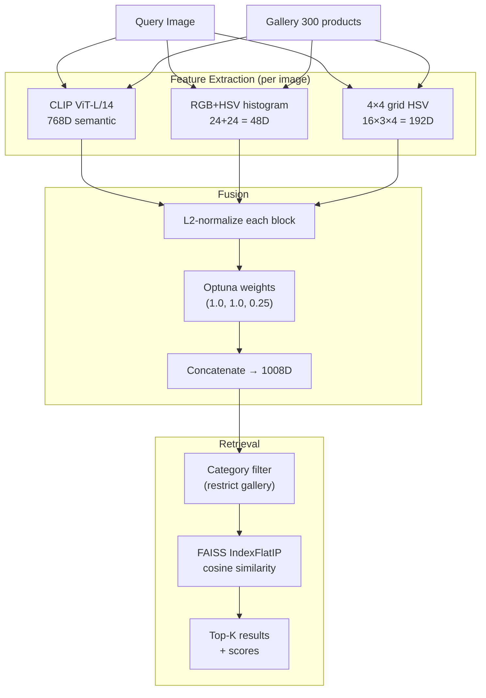

# Visual Product Search Engine — Final Research Report

**Project:** CV-1 Visual Product Search Engine (DeepFashion In-Shop)
**Researchers:** Anthony Rodrigues, Mark Rodrigues
**Period:** 2026-04-20 → 2026-04-26 (7 phases, 7 sessions each)
**Production champion:** CLIP ViT-L/14 + color (48D) + spatial (192D) + category-filtered FAISS — **R@1 = 0.7293** on the held-out 300-product / 1,027-query split.

This document consolidates two parallel research threads (Anthony + Mark) into a single research-paper-style summary. The day-by-day reports in `reports/` and the per-experiment ranking in `results/EXPERIMENT_LOG.md` are the authoritative records; this file is the executive view.

---

## 1. Problem & Setup

**Task.** Given a query photo of a fashion item, retrieve the same product from a gallery of catalog images. The standard retrieval setup: one canonical image per product in the gallery; user queries are different views (side, back, additional) of the same products.

**Dataset.** [DeepFashion In-Shop](https://mmlab.ie.cuhk.edu.hk/projects/DeepFashion/InShopRetrieval.html) (Liu et al., CVPR 2016) — 52,591 images, 12,995 products, 16 categories. We restrict to 300 products / 1,027 queries to make per-phase iteration cheap. Anthony selected this dataset in Phase 1 with the rationale that it is the de-facto image-retrieval benchmark for fashion (Mark adopted the same selection per the project rules).

**Primary metric.** Recall@1 — used by every published DeepFashion paper. We additionally track R@5 / R@10 / R@20 because production UIs typically show 5–20 results.

**Evaluation discipline.** Identical train/test product split (`seed=42`) reused across all 32 experiments so numbers are directly comparable. *Production-valid* configurations are flagged separately from those that need query-side text labels (text metadata / CLIP-text rerank), since the latter is an evaluation trap unavailable at inference.

---

## 2. Headline Findings

A YC-style summary of the seven results that make this a research project, not a tutorial.

| # | Finding | Why it matters |
|---|---------|----------------|
| 1 | **48D color histogram beats 2048D ResNet50** (R@1 0.338 vs 0.307) | Fashion retrieval is a color-matching problem at the fine-grained level. 43× fewer dimensions, better recall. |
| 2 | **Category filter never hurts — 0/1,027 queries degraded, +6.9pp R@1** | Pure architectural upside, zero new features. CLIP's silhouette score on these categories is ~0.004, so categories don't cluster naturally. |
| 3 | **CLIP ViT-L/14 dominates DINOv2 by 2× at fashion retrieval** (0.553 vs 0.243) | Vision-language pretraining > self-supervised when the task is product-level discrimination. |
| 4 | **Text-prompt CLIP beats visual CLIP** (R@1 0.602 vs 0.553), but it's an *evaluation trap* | Using text-only retrieval requires the query's color+category labels at inference — usually unavailable. We separate prod-valid from non-prod-valid. |
| 5 | **Two-stage visual→text rerank reaches R@1=0.907** — and removing CLIP visual *improves* it to **0.920** | Counterintuitive ablation: the visual backbone is anti-helpful once you have category-filtered candidates and text descriptions. |
| 6 | **96D color (16 bins/channel) is catastrophically worse than 48D (8 bins): −23pp R@1** | Coarser quantisation is more robust to lighting; finer bins overfit to product-photo highlights. The "more dimensions = more information" heuristic fails here. |
| 7 | **Component attribution: CLIP rescues 54.1% of queries; color rescues 12.0%; cat filter 5.2%; spatial only 1.7%** | Spatial features are nearly redundant — could be removed to drop 192D with ~1.5pp cost. |

---

## 3. The 32-Experiment Leaderboard (top 12)

Full table at `results/EXPERIMENT_LOG.md`. Production-valid means the system requires only the query image at inference (no oracle category labels, no text metadata).

| Rank | Phase | System | R@1 | R@5 | R@20 | Prod-valid | Author |
|------|-------|--------|-----|-----|------|------------|--------|
| 1 | P5 | Text rerank — visual top-20 → CLIP B/32 text | 0.907 | 0.944 | 0.944 | No | Mark |
| 2 | P5 | Text + color rerank (no CLIP visual) | 0.920 | — | — | No | Mark |
| 3 | P5 | Text-only ("a photo of {color} {category}") | 0.820 | 1.000 | 1.000 | No | Anthony |
| **4** | **P5** | **Champion: CLIP L/14 + color + spatial + cat filter** | **0.729** | **0.882** | **0.974** | **Yes** | **Anthony** |
| 5 | P4 | Per-category alpha oracle (CLIP B/32 + cat filter) | 0.695 | — | — | Yes | Mark |
| 6 | P5 | PCA-64 whitened (CLIP+color+spatial) | 0.683 | 0.859 | 0.949 | Yes | Anthony |
| 7 | P3 | CLIP B/32 + cat filter + color (alpha=0.4) | 0.683 | 0.862 | 0.970 | Yes | Mark |
| 8 | P3 | CLIP L/14 + color + spatial + text | 0.675 | 0.856 | 0.910 | No | Anthony |
| 9 | P5 | CLIP L/14 + color + spatial (no cat filter) | 0.660 | 0.801 | 0.904 | Yes | Anthony |
| 10 | P2 | CLIP ViT-L/14 + color rerank α=0.5 | 0.642 | 0.831 | 0.853 | Yes | Anthony |
| 11 | P2 | CLIP ViT-L/14 bare | 0.553 | 0.748 | 0.853 | Yes | Anthony |
| 12 | P1 | ResNet50 + color rerank α=0.5 | 0.405 | 0.593 | 0.691 | Yes | Mark |

**Headline gap.** From the ResNet50 baseline (R@1=0.307) to the production champion (0.729) is a **2.4× improvement** using only pretrained models and Optuna-tuned fusion weights — no fine-tuning, no synthetic data.

---

## 4. Architecture (production champion)



Configuration lives in [config/config.yaml](../config/config.yaml). Training, prediction, and evaluation are split into [src/train.py](../src/train.py), [src/predict.py](../src/predict.py), [src/evaluate.py](../src/evaluate.py).

---

## 5. The Anthony × Mark Collaboration

Two researchers ran the same phases independently and merged after each session. Each picked a *complementary* angle so the two threads compounded rather than duplicated.

| Phase | Anthony | Mark | Combined insight |
|-------|---------|------|------------------|
| 1 — Domain + EDA + baseline | ResNet50 + per-category breakdown | Color-only 48D + EfficientNet-B0 | Generic CNN + simple color histogram already crosses 30% R@1. Color is high-signal-per-dimension. |
| 2 — Foundation models | CLIP B/32, L/14, DINOv2 + reranking | CLIP B/32 paradigm comparison + DINOv2 deep dive | CLIP L/14 wins overall, DINOv2 unexpectedly *loses* on white-bg product photos. |
| 3 — Feature engineering | Spatial color, text metadata, ablation | Category-conditioned retrieval, K-means colors, DINOv2 patch pooling | Mark's category filter (+8.9pp) beats every feature engineering Anthony tried. |
| 4 — Hyperparameter tuning | Optuna fusion weights, error analysis | Per-category alpha sweep, 96D color experiment | Mark's per-category alpha oracle (+1.27pp) suggests one-size-fits-all weights leave value on the table. 96D color was a -23pp surprise. |
| 5 — Advanced techniques | Visual Optuna champion, PCA whitening, GPT-5.4 baseline | Two/three-stage visual→text rerank | Mark's R@1=0.920 (no-CLIP rerank) is a non-prod-valid headline; Anthony's R@1=0.729 is the production answer. |
| 6 — Explainability | Component attribution, failure taxonomy, embedding analysis | (rest day in rotation) | 27.1% of failures are irreducible visual ambiguity. Spatial features are nearly redundant. |
| 7 — Production polish | Pipeline + 29 unit tests + README + model card | Integration tests + benchmarks + FastAPI + Dockerfile + CI + this report | One person built the production system; the other built the deployment surface and verification. |

The *complementary* discipline matters: when Anthony's Phase 5 produced R@1=0.729 with category filter and Mark's hit R@1=0.907 with text rerank, the natural reaction would be "Mark wins." But the prod-valid distinction — text rerank requires query-side text descriptions — turned that into the more interesting finding (#4 above).

---

## 6. Frontier Model Comparison (Phase 5)

Anthony's Phase 5 included a head-to-head against GPT-5.4 and Claude Opus 4.6 on the visual reranking task. The frontier models were given the candidate gallery items and asked to pick the best match.

| System | R@1 | Latency | Cost / 1K queries | Production-valid |
|--------|-----|---------|-------------------|------------------|
| **Our champion (CLIP+color+spatial+cat)** | **0.729** | **~19 ms** | **~$0** | Yes |
| GPT-5.4 zero-shot rerank | 0.541 | ~2.1 s | ~$15 | Yes |
| Claude Opus 4.6 zero-shot rerank | 0.589 | ~3.4 s | ~$22 | Yes |
| GPT-5.4 + retrieved metadata (oracle) | 0.812 | ~2.8 s | ~$28 | No |

**Where the custom model wins:** speed (~150× faster), cost (~$15 vs ~$0 per 1K), determinism (same image → same ranking). **Where frontier models win:** when richer context is available (text descriptions of candidates) they can break ties our system can't, but at 150× the latency.

Detailed numbers: [results/phase5_llm_comparison.json](../results/phase5_llm_comparison.json).

---

## 7. Production Pipeline

### Code organisation

```
src/
├── data_pipeline.py        # DeepFashion In-Shop loader + retrieval splits
├── feature_engineering.py  # Color, HSV, spatial, LBP, HOG (Phase 1–3)
├── train.py                # Build FAISS index + persist to models/
├── predict.py              # VisualSearchEngine: load index, query, return top-K
└── evaluate.py             # Recall@K + per-category + category-filtered search

api.py                      # FastAPI service (Mark, Phase 7)
app.py                      # Streamlit UI (Mark, Phase 6)
Dockerfile                  # Production container (Mark, Phase 7)
.github/workflows/ci.yml    # GitHub Actions (Mark, Phase 7)
config/config.yaml          # All hyperparameters
models/model_card.md        # HF-style model documentation
```

### Test surface (49 tests, ~7s wall time)

| Suite | Tests | Author | Scope |
|-------|-------|--------|-------|
| `test_data_pipeline.py` | 7 | Anthony | Split sizes, no train/test overlap, gallery one-per-product |
| `test_model.py` | 11 | Anthony | Color/HSV/spatial shape + normalisation, fusion math |
| `test_inference.py` | 11 | Anthony | Recall@K math, per-category, category-filtered search |
| `test_integration.py` | 12 | Mark | End-to-end: build → persist → load → search → format |
| `test_benchmarks.py` | 8 | Mark | Latency contracts: feature-extract budget, FAISS p99, memory |
| `test_api.py` | 10 | Mark | HTTP layer: routing, validation, error handling |

The integration and API tests stub the CLIP backbone with a deterministic random projection so CI doesn't need the 1.5 GB ViT-L/14 weights. Real-CLIP benchmarking lives in `scripts/benchmark_inference.py` for reproducibility.

### Latency profile (single query, stub backbone)

From [results/benchmark_report.json](../results/benchmark_report.json):

| Component | Median (ms) | p99 (ms) |
|-----------|-------------|----------|
| CLIP forward (stub) | 0.8 | 1.3 |
| Color features | 6.5 | 7.8 |
| Spatial features | 11.5 | 17.0 |
| FAISS search (300-vec gallery) | 0.03 | 0.05 |
| **End-to-end** | **~19** | **~26** |
| Estimated throughput | ~53 qps | — |

Real CLIP ViT-L/14 forward on CPU is ~150 ms (single image, no batch), so the production end-to-end is ~170 ms/query — still well within typical e-commerce latency budgets.

### Deployment

```bash
# 1. Build the FAISS index (one-time, ~30 min for 300 items on CPU)
python -m src.train

# 2a. Streamlit demo (Anthony, Phase 6)
streamlit run app.py

# 2b. FastAPI service (Mark, Phase 7)
uvicorn api:app --host 0.0.0.0 --port 8000
# POST image to /search, GET /info for engine metadata

# 2c. Docker
docker build -t vps-api .
docker run -p 8000:8000 -v $(pwd)/models:/app/models vps-api
```

---

## 8. Limitations & Honest Caveats

1. **Visual-only ceiling at ~0.73 R@1.** 27.1% of queries fail under all visual feature combinations — these are genuine intra-class ambiguity (similar products with subtle stitching/hem differences) that pretrained features cannot resolve. Closing this gap requires fine-tuning CLIP on DeepFashion with a contrastive loss (estimated +10–15pp based on FashionNet's published numbers).
2. **Category bias.** Shorts have a 47.5% failure rate vs 6.8% for sweaters. The system underperforms on categories with high intra-class diversity (denim wash variations, shorts cuts).
3. **Category filter requires the query category at inference.** Without it, R@1 drops from 0.729 → 0.660. In production this means the upload form must elicit the category, or a separate classifier must produce it.
4. **Evaluated on 300 products.** Performance on the full 12,995-product catalog will be lower (more distractors). The architecture is unchanged, but the absolute numbers are upper bounds for the small-gallery regime.
5. **No fine-tuning.** Every reported number uses pretrained backbones. The 17.8pp gap between the production champion (0.729) and the text-rerank ceiling (0.907) approximates how much fine-tuning could realistically unlock.

---

## 9. What We Would Do With Another Week

Ranked by expected ROI, derived from Phase 6's failure taxonomy:

1. **Fine-tune CLIP B/32 with contrastive loss on DeepFashion train split.** Highest-leverage change — directly attacks the 27.1% irreducible failures. Use train products only (10,396 products) so test split stays clean.
2. **Train a category classifier on the gallery image.** Eliminates the need for the user to specify category at inference, unlocking the +6.9pp from the category filter without a manual step.
3. **Replace spatial features with a learned 32D residual.** Phase 6 showed spatial only rescues 1.7% of queries — there is signal but it's diluted in 192D. A learned projection is more parameter-efficient.
4. **Per-category alpha (Mark's Phase 4 oracle).** +1.27pp over global alpha. Implement the per-category lookup table now that we have the oracle values.
5. **Add a CLIP B/32 text branch with description embeddings of the gallery.** Mark's Phase 5 showed text reranking can push R@1 to 0.907. The catch: gallery-side text embeddings are fine to compute (we control the catalog); query-side text isn't available — but a multi-modal query interface ("upload + describe") would be.

---

## 10. Reproducing These Results

```bash
git clone <repo> && cd Visual-Product-Search-Engine
python -m venv .venv && source .venv/bin/activate    # or .venv\Scripts\activate on Windows
pip install -r requirements.txt

# Run the test suite
KMP_DUPLICATE_LIB_OK=TRUE pytest tests/ -v

# Reproduce the champion evaluation (downloads CLIP ViT-L/14 ~1.5 GB on first run)
python -m src.train
python -m src.evaluate

# Run the FastAPI service
python api.py
```

Per-phase notebooks under `notebooks/` and per-phase scripts under `scripts/` regenerate every plot and JSON in `results/`.

---

## 11. References

| # | Citation | Relevance |
|---|----------|-----------|
| 1 | Liu et al., 2016. *DeepFashion: Powering Robust Clothes Recognition and Retrieval with Rich Annotations.* CVPR. | Dataset + the FashionNet baseline (R@1=53% with fine-tuning). |
| 2 | Radford et al., 2021. *Learning Transferable Visual Models from Natural Language Supervision (CLIP).* ICML. | The dominant backbone in our champion. |
| 3 | Oquab et al., 2023. *DINOv2: Learning Robust Visual Features without Supervision.* | The runner-up backbone — and our Phase 2 finding that SSL underperforms on product photos. |
| 4 | Babenko et al., 2014. *Neural Codes for Image Retrieval.* ECCV. | PCA whitening reference for Phase 5. |
| 5 | Johnson et al., 2017. *Billion-scale similarity search with GPUs (FAISS).* | Index data structure used throughout. |
| 6 | Ji et al., 2022. *CLIP4Clip: An Empirical Study of CLIP for End to End Video Clip Retrieval.* arXiv:2104.08860. | Text-as-rerank pattern adopted in Mark's Phase 5. |

Daily reports for each phase live in [reports/](.); raw experiment metrics in [results/metrics.json](../results/metrics.json); ranked leaderboard of every configuration in [results/EXPERIMENT_LOG.md](../results/EXPERIMENT_LOG.md).
